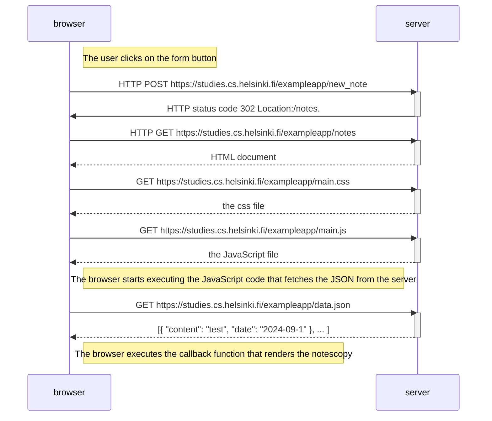

```mermaid
 sequenceDiagram
    participant browser
    participant server

Note right of browser:The user clicks on the form button
browser->>server: HTTP POST https://studies.cs.helsinki.fi/exampleapp/new_note
activate server
server->>browser: HTTP status code 302 Location:/notes.
deactivate server

browser->>server: HTTP GET https://studies.cs.helsinki.fi/exampleapp/notes
activate server
server-->>browser: HTML document
deactivate server

browser->>server: GET https://studies.cs.helsinki.fi/exampleapp/main.css
activate server
server-->>browser: the css file
deactivate server

browser->>server: GET https://studies.cs.helsinki.fi/exampleapp/main.js
activate server
server-->>browser: the JavaScript file
deactivate server

Note right of browser: The browser starts executing the JavaScript code that fetches the JSON from the server

browser->>server: GET https://studies.cs.helsinki.fi/exampleapp/data.json
activate server
server-->>browser: [{ "content": "test", "date": "2024-09-1" }, ... ]
deactivate server

Note right of browser: The browser executes the callback function that renders the notescopy


```
